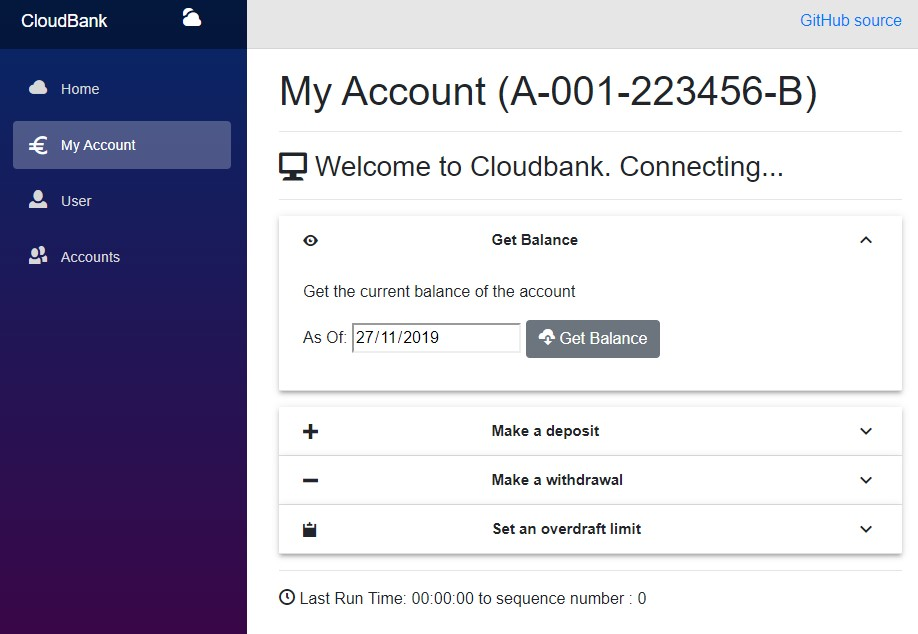

# CloudBank

CloudBank is a demo front end to show how to put a Blazor UI front end over Azure functions using Event Sourcing for the data storage

This client side web application sends commands to the Bank Account **event sourcing** demo application which uses Azure Tables as the storage mechanism for the event streams underlying each bank account.

You can try it out from any modern web browser at [this URL](https://retailbank.z6.web.core.windows.net/)

## Using the application

When the application is launched the front screen as above is shown, with the navigation bar down the left hand side.  This is pretty much an out of the box standard Blazor site template.

### Creating a new account

Click on the **User** menu to go to the form that allows you to create a new bank account.  You can either type your own choice of bank account number of select the *generate random account number* button to have the system create one.

Once you have created a new account you can navigate to it with the *navigate to {accountnumber}* button.

### Getting the account balance

To get the account balance select the first section and it will open up and the button *get balance* can be used to trigger the Azure function that gets the balance for this bank account. 

Because the backing store is event sourced it is just as easy to get the state as at some past date as it is to get the current state so you can enter an *as of* date and the system will return the account balance as at that date.

### Making a deposit

The second expandable section allows you to make a deposit.

There are parameters to fill in for the deposit amount, deposit source and any commentary and then pressing the *submit* button will pass these to the Azure function to make the deposit.

When a the deposit is made a message will indicate this.

### Making a withdrawal

The third expandable section is for making a withdrawal.

This has parameters for ammount and for commentary and again pressing the *submit* button sends these parameters to the Azure function.

Because the fuunction to make a withdrawal needs to run a projection that checks the current balance (to prevent the account being overdrawn beyond its limit) this function also returns information about the account balance.

### Setting an overdraft

For every Azure function executed the system will also return the total time it took to execute the function and if the function also runs any projections over the event stream it will also return the **sequence number** of the last event read.

## How it works

